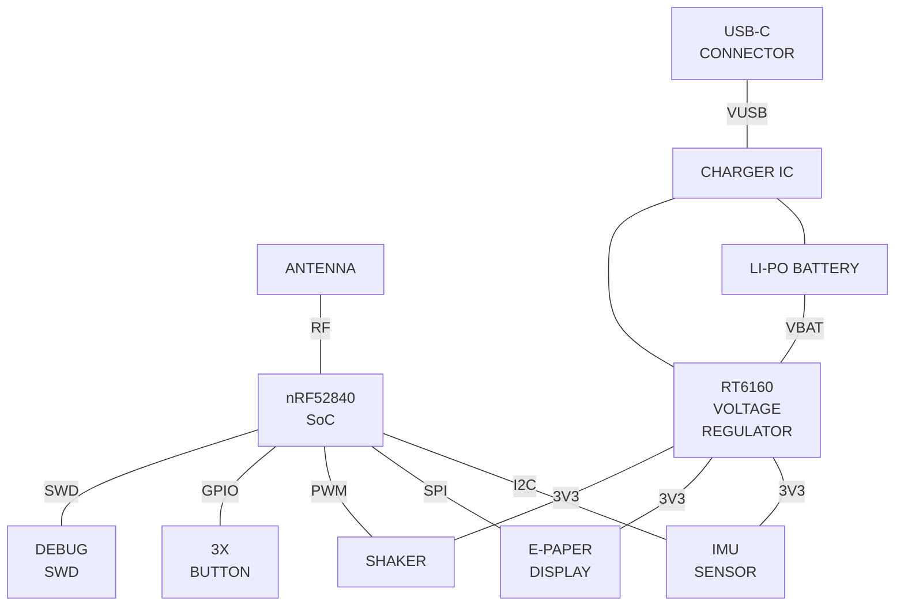

# InkTime - E-Paper Smartwatch Hardware Design

## 1. System Block Diagram
*This diagram illustrates the main hardware modules and their data/power connections to the central processing unit.*

## 1. Bill of Materials (BOM)

| Component | JLC Part # | Package | Description | Datasheet |
| :--- | :--- | :--- | :--- | :--- |
| **J1** | C122434 | SMD,P=0.5mm,Surface Mount，Right Angle | FFC & FPC Connectors 0.5mm FPC RA SMT Dual Contact 24Ckt | [datasheet](https://octopart.com/datasheet/tag-connect/TC2030-IDC) |
| **L1, L2, L3** | C12669 | 402 | Generic chip inductor | [datasheet](https://www.lcsc.com/datasheet/C12669.pdf) |
| **L5** | C1329646 | SMD,4.8x4.8mm | 1.6A 1.6A 4.7uH 41.4mΩ AEC-Q200 ±30% SMD,4.8x4.8mm Power Inductors ROHS | [datasheet](https://wmsc.lcsc.com/wmsc/upload/file/pdf/v2/lcsc/2304140030_BOURNS-SRR4828A-4R7Y_C1329646.pdf) |
| **IC3** | C189517 | LGA-12(2x2) | Accelerometers Triaxial low-g 12bit Acceleration Sensor | [datasheet](https://files.pine64.org/doc/datasheet/pinetime/BST-BMA421-FL000.pdf) |
| **Q1** | C2564 | TO-220AB | -55℃~+175℃ 1 P-Channel 180nC@10V 200W 20mΩ@10V 3.4nF 4V 55V 640pF 74A P-Channel TO-220AB MOSFETs ROHS | [datasheet](https://files.pine64.org/doc/datasheet/pinetime/BST-BMA421-FL000.pdf) |
| **U3** | C2682616 | DFN-8-EP(2x2) | -40℃~+85℃ 1 2.5V~4.5V 3uA I2C Lithium Battery DFN-8-EP(2x2) Battery Management ROHS | [datasheet](https://www.analog.com/en/products/max17048.html?ADICID=synd_ww_portfolio_pi_octopart_na_2024) |
| **ANT1** | C2917717 | 1206 | -45℃~+125℃ 0.5dBi 1.3mm 1.6mm 100MHz 2.45GHz 2W 3.2mm 50Ω Patch Antenna 1206 Antennas ROHS | [datasheet](https://www.alldatasheet.com/datasheet-pdf/pdf/348957/JOHANSON/2450AT18B100.html) |
| **D3** | C2969755 | SOT-23-6L | Low Cap. ESD Protection Auto SOT-23-6 STMicroelectronics USBLC6-2SC6Y, Dual Uni-Directional TVS Diode Array, 6-Pin SOT-23 | [datasheet](https://octopart.com/datasheet/stmicroelectronics/USBLC6-2SC6Y) |
| **X2** | C32346 | SMD3215-2P | -40℃~+85℃ 12.5pF 32.768kHz 70kΩ Crystal Oscillator ±20ppm SMD3215-2P Crystals ROHS | [datasheet](https://www.lcsc.com/datasheet/C32346.pdf) |
| **U1** | C3606653 | QFN-48(6x6) | nRF52840 | [datasheet](https://octopart.com/datasheet/nordic-semiconductor/NRF52840-QIAA-T) |
| **IC1** | C3682423 | DSBGA-8(1.1x1.6) | Charger IC Lithium Ion/Polymer, Lithium Iron Phosphate 8-DSBGA (1.6x1.1) | [datasheet](https://www.alldatasheet.com/datasheet-pdf/pdf/1359210/TI/BQ25180YBGR.html) |
| **R17-R18, R1_EP_DR, R1_USB, R2-R5, R7-R9, R_PWR_EPD, R_TYPE_SEL** | C3920633 | 0201 | 7.68k 0201 Thin Film Surface Mount Fixed Resistor +/-0.5% 870.031W CPF0201D7K68C1 |  |
| **Q3** | C469327 | SOT-323 | MOSFET N-Ch 30V 1.5A TrenchFET SC70 Vishay Si1308EDL-T1-GE3 N-channel MOSFET Transistor, 1.5 A, 30 V, 3-Pin SC-70 | [datasheet](https://4donline.ihs.com/images/VipMasterIC/IC/VISH/VISH-S-A0000692786/VISH-S-A0000692786-1.pdf?hkey=6D3A4C79FDBF58556ACFDE234799DDF0) |
| **SW_DN, SW_ENT, SW_UP** | C569760 | SMD,3.9x2.9mm | -40℃~+85℃ 1.6N 1.6mm 15V 2.9mm 20mA 3.9mm 500,000 Cycles IP67 J-Lead Rectangular Button SPST Surface Mount White With Bracket | [datasheet](https://wmsc.lcsc.com/wmsc/upload/file/pdf/v2/lcsc/2301111010_PANASONIC-EVPAKE31A_C569760.pdf) |
| **L7** | C5832368 | 1008 | 13mΩ 470nH 6.5A 7.5A ±20% 1008 Power Inductors ROHS | [datasheet](https://www.lcsc.com/datasheet/C5832368.pdf?spm=wm.sxq.inf.ggs&lcsc_vid=RQcLUgVXFFNXXwFeQQJaUQVXFgRWA1xUFlcIVABQQQQxVlNRQVZXXlBXQ1VfUjsOAxUeFF5JWBYZEEoBGA4JCwFIFA4DSA%3D%3D) |
| **IC9** | C7065276 | WLCSP-15B(2.3x1.4) | Buck-Boost Regulator Positive Output Step-Up/Step-Down I2C DC-DC Controller IC 15-WL-CSP | [datasheet](https://www.alldatasheet.com/datasheet-pdf/pdf/1709403/RICHTEK/RT6160AWSC.html) |
| **J4** | C709357 | SMD | 16P Female Surface Mount, Right Angle Type-C SMD USB Connectors ROHS | [datasheet](https://www.lcsc.com/datasheet/C709357.pdf) |
| **IC2** | C81079 | DSBGA-9 | Haptic Driver for ERM/LRA with Built-In Library and Smart Loop Architecture | [datasheet](https://www.alldatasheet.com/datasheet-pdf/pdf/489356/TI/DRV2605.html) |
| **D2, D4, D5** | C82046 | SOD-123 | ON SEMICONDUCTOR - MBR0530 - DIODE, SCHOTTKY, 0.5A, 30V, SOD-123 | [datasheet](https://www.lcsc.com/datasheet/C82046.pdf) |
| **X1** | C9009 | SMD3225-4P | 32MHz Crystal Oscillator ±10ppm ±20ppm SMD3225-4P Crystals ROHS | [datasheet](https://www.lcsc.com/datasheet/C9009.pdf) |
| **J2** | C90533 | P=1mm | CABLE ADAPTER 6 POS | https://octopart.com/datasheet/tag-connect/TC2030-IDC |
| **C6, C14, C15, C20, C21, C24, C25, C33, C39** | C9900179830 | 0402 | Generic chip capacitor |  [datasheet](https://octopart.com/datasheet/kyocera-avx/0402YC104KAT2A) |
| **EPD_C1 - EPD_C12** | C9900179830 | 0402 | Generic chip capacitor | [datasheet](https://octopart.com/datasheet/kyocera-avx/0402YC104KAT2A) |
| **C1, C2, C3, C4, C5, C7, C8, C9, C10, C11, C12, C13, C16, C17, C18, C19** | C9900156064 | 0201 | Generic chip capacitor | [datasheet](https://www.we-online.com/components/products/datasheet/885012104003.pdf?srsltid=AfmBOorfnt8kPvUhmauvZrnnkcX57K9BGcdXKzCLOcfskhqns-UBbXMT) |

## 3. Hardware Functionality & Specifications

The InkTime hardware architecture is centered around a **30-day battery life** target, utilizing an ultra-low-power interrupt-driven design.

### 1. Core Processing & Connectivity
* **SoC:** **nRF52840** (ARM Cortex-M4F) handles BLE 5.0 connectivity and main system logic.
* **Clocking:** 32MHz crystal for high-speed operations and a 32.768kHz crystal for accurate RTC timekeeping during sleep.
* **Programming:** Integrated **SWD** interface accessible via a Tag-Connect TC2030 footprint.

### 2. Power Management System
* **Battery:** **250mAh LiPo** (AKYGA LP502030) providing the primary power source.
* **Charging:** **BQ25180** charger IC manages USB charging via I2C and signals MCU on power events.
* **Regulation:** **RT6160** Buck-Boost converter stabilizes the 3.3V system rail across the full battery voltage range.
* **Monitoring:** **MAX17048** Fuel Gauge tracks battery State of Charge (SoC) via I2C with precision.

### 3. Display & User Interface
* **Display:** **1.54" E-Paper** (200x200) connected via **SPI**.
* **Power Gating:** An **SI2301 P-FET** switch is used to completely cut power to the display circuit between refreshes to eliminate leakage.
* **Refresh Policy:** Partial refresh is triggered once per minute to minimize energy consumption.
* **Input:** Three side-mounted tactile buttons (Up, Down, Enter/Esc) configured with internal pull-ups and wake-on-low interrupts.

### 4. Sensors & Haptics (I2C Bus)
* **Motion Sensing:** **BMA421** Accelerometer provides step counting and gesture wake-up functionality.
* **Haptic Feedback:** **DRV2605L** driver controls an **ERM vibration motor** to provide tactile notifications.
* **Efficiency:** Both modules are strictly managed; the haptic driver is disabled via an Enable pin when not in use.

### 5. Energy Profile
* **Sleep Current:** System spends >95% of time in deep sleep with peripherals powered down.
* **Active Peaks:** Energy is primarily consumed during BLE transfers and 1-minute display updates (~8mAs per update).

## 4. Detailed Pinout & Design Justification (nRF52840)

The pin mapping for the nRF52840 was optimized for **Power Efficiency**, **Signal Integrity (RF)**, and **PCB Routing** (minimizing via count and crossing traces).

### Communication & Power Control
| Pin | Net Name | Component | Justification |
| :--- | :--- | :--- | :--- |
| **ANT** | RF_OUT | Ceramic Antenna | Dedicated RF output requiring a 50Ω matched trace to the antenna network. |
| **P0.06 / P0.07** | I2C_SDA / SCL | Shared I2C Bus | Shared bus for BMA421, MAX17048, DRV2605L, and BQ25180 to conserve pins and simplify routing. |
| **P0.02 / P0.03** | EPD_SCK / MOSI | E-Paper (SPI) | High-speed SPI clock and data for the display. |
| **P0.05** | EPD_CS | E-Paper (SPI) | Chip Select to keep the EPD controller inactive when the bus is shared. |
| **P0.15 / P0.16** | EPD_DC / RST | E-Paper Control | Dedicated pins for Data/Command toggling and hardware reset. |
| **P0.17** | EPD_BUSY | E-Paper Status | Monitors internal state, allowing the MCU to sleep during EPD refresh cycles. |
| **P1.01** | PWR_EPD | P-FET Gate (Q4) | **Critical:** High-side power gating to physically cut power to the EPD, eliminating standby leakage. |

### User Input & Interrupts
| Pin | Net Name | Component | Justification |
| :--- | :--- | :--- | :--- |
| **P0.13 / P0.14** | SW_UP / SW_DN | Nav Buttons | Configured with internal pull-ups. Supports "Wake-on-Low" to wake the SoC from deep sleep. |
| **P1.00** | SW_ENT | Enter Button | Placed on Port 1 to simplify physical trace routing to the right edge of the PCB. |
| **P0.08** | IMU_INT1 | BMA421 (INT) | Primary interrupt for step detection, waking the MCU only when necessary. |
| **P0.12** | HAPTIC_EN | DRV2605L | Completely disables the haptic driver IC when inactive to save microamps of quiescent current. |

### System Timing & Debug
| Pin | Net Name | Component | Justification |
| :--- | :--- | :--- | :--- |
| **XC1 / XC2** | 32M_XTAL | 32MHz Crystal | Essential for BLE radio operation and high-accuracy internal timing. |
| **XL1 / XL2** | 32K_XTAL | 32.768kHz Crystal | Low-power clock for the RTC, keeping time while the system is in deep sleep. |
| **SWDIO / CLK**| SWD_DATA / CLK | Tag-Connect J2 | Standard ARM programming interface, placed near the edge for easy access. |

