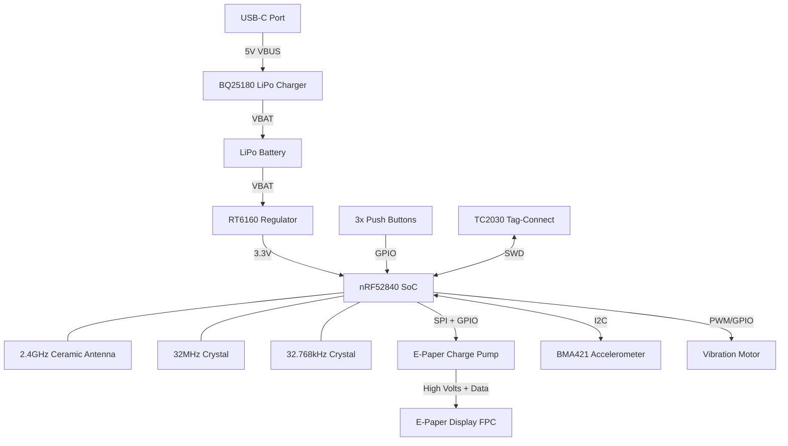

# InkTime - E-Paper Smartwatch Hardware Design

## 1. System Block Diagram
*This diagram illustrates the main hardware modules and their data/power connections to the central processing unit.*

## 2. Microcontroller Pinout (nRF52840)

*The exact pinout was chosen to optimize the PCB layout (Rat's nest un-tangling) and separate high-speed data lines from analog/RF lines.*

| Pin / Net Name | Function | Connected To | Justification |
| :--- | :--- | :--- | :--- |
| **ANT** | RF Out | 2450AT18B100E Antenna | Dedicated RF pin. Must be routed directly to the matching network. |
| **XC1 / XC2** | Clock | 32MHz Crystal (X1) | Dedicated high-frequency clock pins. |
| **XL1 / XL2** | Clock | 32.768kHz Crystal (X2) | Dedicated low-frequency RTC clock pins. |
| **SWDIO / SWDCLK** | Debugging | Tag-Connect J2 | Standard ARM Serial Wire Debug interface. |
| **P1.0x (SPI_MOSI)** | SPI Data | EPD Connector | E-Paper image data transfer. |
| **P1.0y (SPI_SCK)** | SPI Clock | EPD Connector | E-Paper SPI clock. |
| **P0.xx (I2C_SDA)** | I2C Data | BMA421 & BQ25180 | Shared I2C bus for sensors and PMIC configuration. |
| **P0.yy (I2C_SCL)** | I2C Clock | BMA421 & BQ25180 | Shared I2C bus clock. |
| **P0.zz (GPIO)** | Digital Out | Motor Transistor | Used to trigger the vibration motor. |
